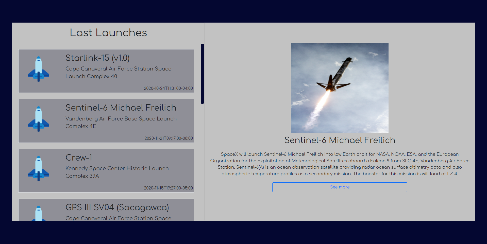
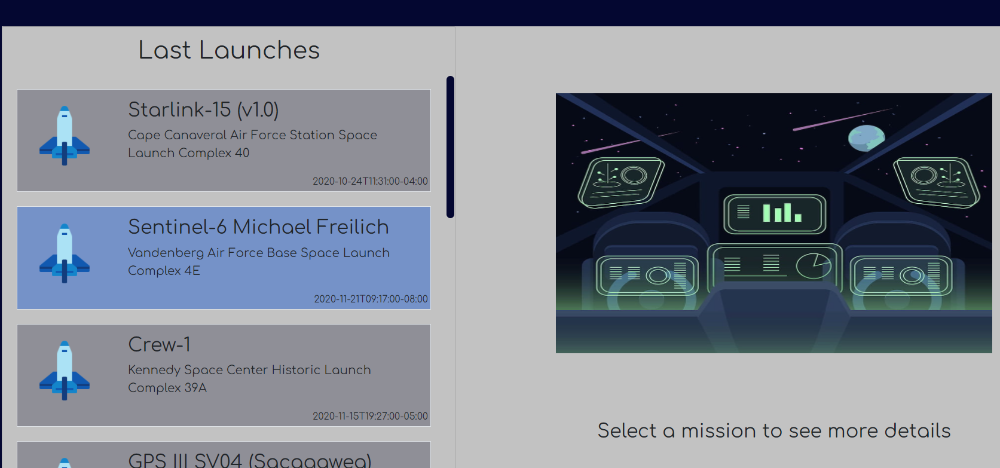
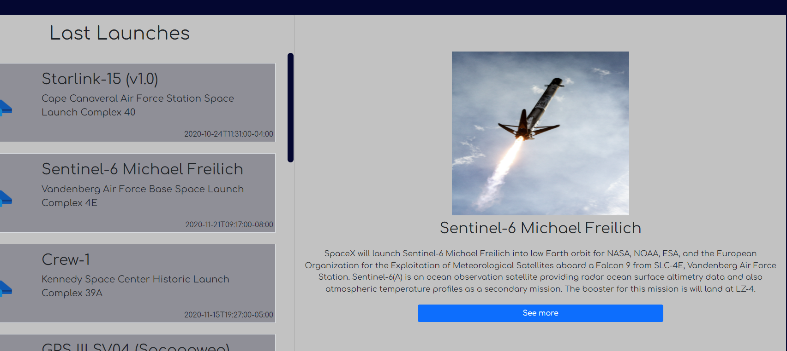
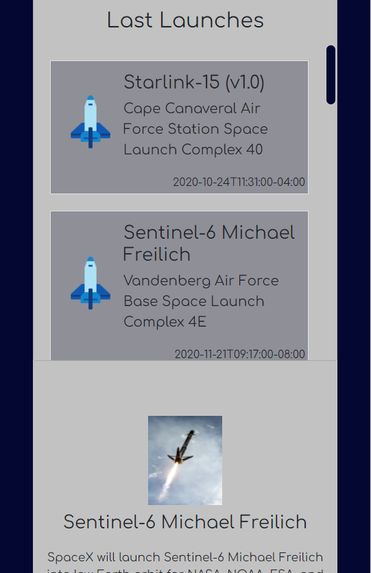

# Project SpaceX

My name is Daiana, I am a frontend developer. 
This project is a website with external API data: SpaceX
The tools you use are: **HTML**, **CSS**, **Bootstrap**, **ReactJs**, **Apollo Client**, **Graphql**

## How did you decide which technologies to use as part of your solution

Use these tools because they are the ones I feel most comfortable with, **HTML** and **CSS** was the first thing I learned when I started in the world of programming. As the first *framework* I learned **ReactJs**, I felt so comfortable working with this tool that I wanted to continue using it and learn everything related to frontend.

## Instructions

- Needed [ node.js ](https://nodejs.dev/) and npm installed
- Download the project from the repository and then in the terminal run 'npm install'

- Once the page is executed, you just have to click on a card on the left and in the right field all the information will appear

## What would you do differently if you were allocated more time?

If I had had more time, I would like to give more details to the responsive design, so that it can be adapted to any screen and / or device

Working on this project I liked a lot, I was able to learn about Apollo Client and Graphql.
I hope you like it too!

## Thanks and greetings!

