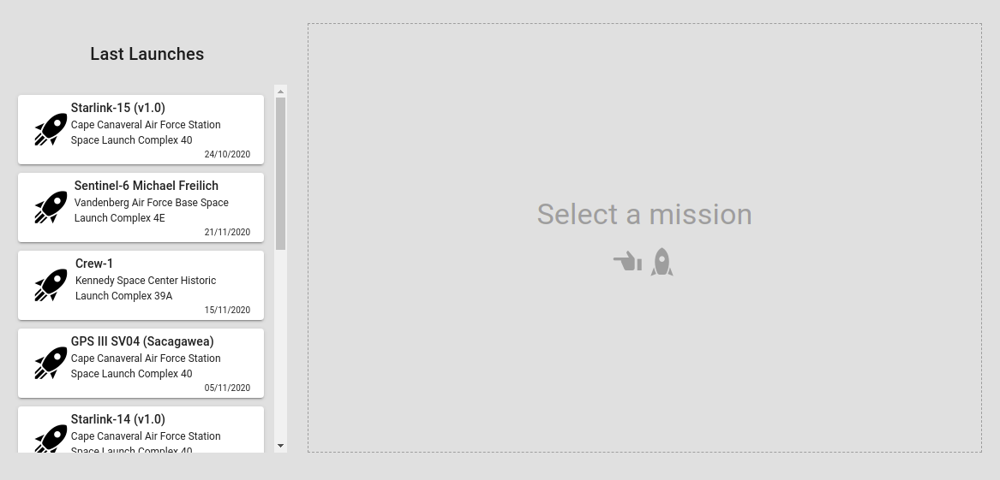
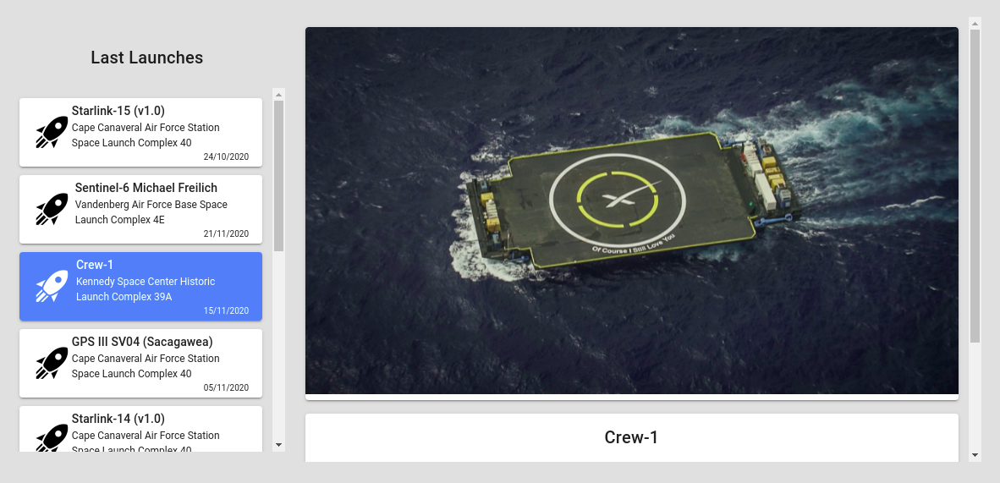
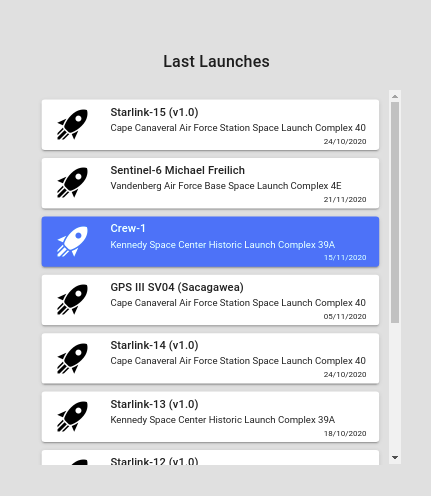
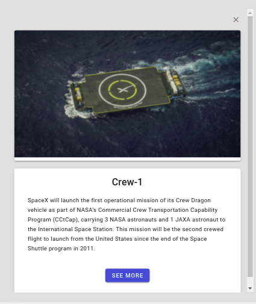

# Instrucciones

## Clone este repositorio

## Ejecute su terminal apuntando a la carpeta obtenida

```
    cd spacex-ui

    npm install

    npm run serve
```

### Abra http://locahost:8080 en su navegador e interactue con la aplicacion


# TECNOLOGÍAS

- Vue.js 2: Es la tecnología que mas domino en el área del frontend y con la cual he trabajado antes en proyectos con clientes.
- Vuex: Almacén global de estados. La prefiero para hacer comunicación entre componentes altamente anidados. En este caso, la aplicación se bifurca desde el componente App.vue en dos componentes LauchesList.vue y LauchSingle.vue, por ende estos dos componentes son hermanos. La comunicación entre hermanos puede realizarse con funciones activadores de eventos, pero esto conlleva a un código enredado y muy poco escalable o mantenible. Además, estos componentes incluyen componentes más pequeños dentro, que suelen activar eventos difíciles de controlar si no se tiene fácil acceso al estado de la aplicación.
- Vuetify: Paquete de componentes. Lo agregué principalmente para apoyarme de sus clases predefinidas. Además fue necesario para realizar el carrusel, los iconos, los botones y otros pocos componentes utilizados. Cabe destacar que también se agregó código css porque se requería ciertas funcionalidades más personalizadas.
- Fetch: Mis opciones principales eran Axios y Fetch. Decidí utilizar Fetch para realizar las consultas ya que se encuentra dentro del núcleo de Javascript, por ende no hay necesidad de agregar ninguna otra biblioteca. Al no necesitar el enlace directo de cookies ni encabezados HTTP más avanzados, fetch fue suficiente. NOTA: Primera vez que realizo una consulta a una api GraphQL. Me gusto mucho la experiencia de poder manejar los datos que requiero desde el front. Gracias a esta experiencia voy a profundizar más en esta tecnología.
- Moment.js: Se requería dar formato "DD/MM/YYYY" a las fechas y con moment fue suficiente.


# MEJORAS EN EL ENVÍO

- Mejoras en UX/UI. No soy un especialista en diseño interactivo, es por eso que esta sería una labor de peso para mi, me llevaría más tiempo del que podría llevarle a un diseñador. Pero si podría realizar ciertas mejoras al mostrar el contenido al usuario final.
- Realizaría pruebas. Soy desarrollador JR, no estoy tan familiarizado con las pruebas. Culminada este desarrollo tengo un poco más de curiosidad por indagar en el mundo del Unit Testing.
- Mostraría más detalles de la misión.


# SI TUVIERA MAS TIEMPO

- Consultar más de un máximo de 10 misiones. A la mejora anterior le agregaría una paginación basada en scroll. Con esto será posible consultar muchas más misiones sin ralentizar el renderizado.
- Ampliará la cadena de consultas. Habiendo visto la API, es fácil detallar que hay muchos más datos que obtener de cada misión. Para aprovechar el poder de GraphQL, conforme el cliente vaya interactuando, traería más datos de interés.
- Con más tiempo (Depende de que tanto) se podría no solo consultar lanzamientos. Podría establecerse un menú de navegación con todos los otros posibles elementos a consultar para así desarrollar una web muy completa sobre SpaceX. Entre esos otros datos a consultar se encuentran por ejemplo las cápsulas, los detalles de la compañía, historias, entre otros.


### CAPTURAS


- Vistas de escritorio






- Vistas movil




