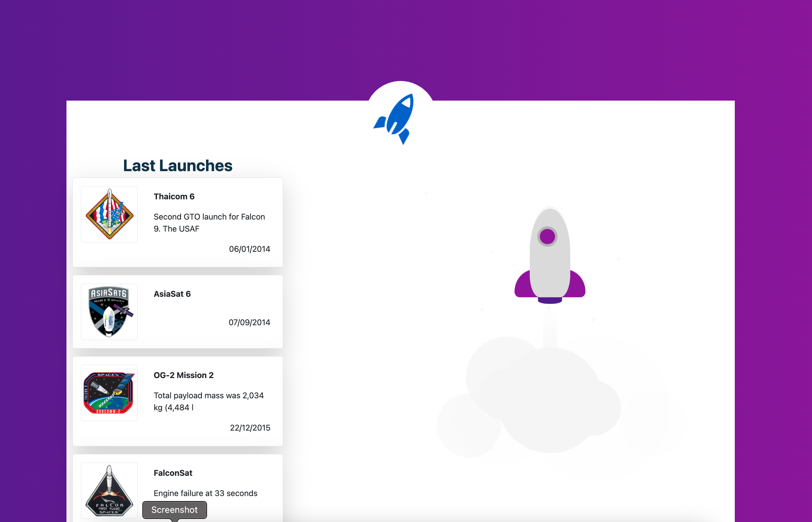
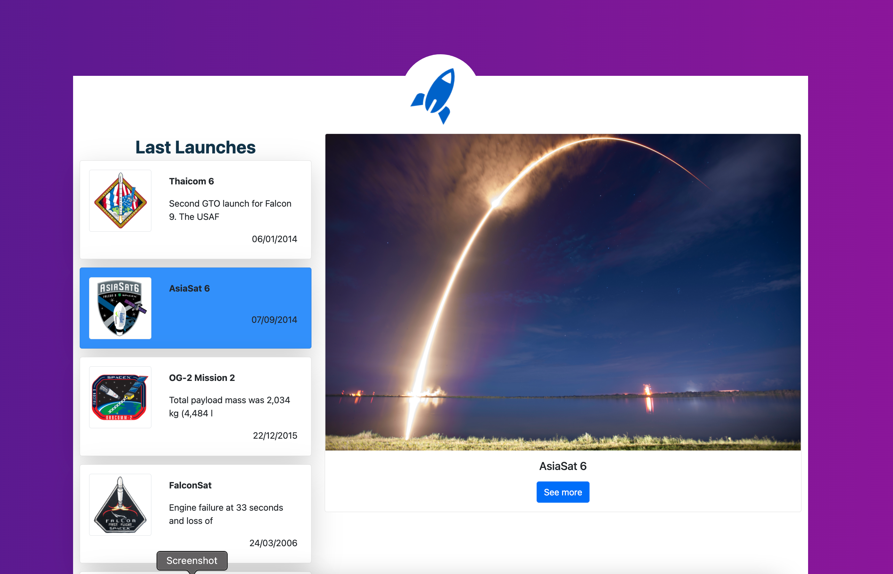

# Spacex Client by Angel Ruiz

## Acerca de

Proyecto elaborado usando Angular 11, y como framework css se utliza Bootstrap para la elaboración de la interfaz, para el consuo del API de SpaceX, se utilizó la librería de apollo-client. Actualmente Angular es el framework que mejor se ha adaptado a mis necesidades, y con el cual he implementado diversos proyectos para consumir servicios externos.

En cuanto al tiempo invertido, si estuviera dedicado a este proyecto sin ninguna actividad extra, con toda seguridad podría haberla implementado con react, asi mismo, pulir detalles de la interfaz como son las posiciones de los elementos y fuentes para otorgar uniformidad, al igual que mejorar la estructura del proyecto Angular usando modulos, para una mejor organización y buenas prácticas.

Respecto a TDD, solo lo he implementado de lado del back con Python, sin embargo, en el front, no he trabajado este tipo de pruebas, lo cual no significa que no este consiente de la importancia, pero me resulta en este caso, algo nuevo aplicar TDD en el front.

Agradezco al equipo de 99minutos por la oportunidad de hacer esta prueba. Muchas gracias.





## Instalación

El proyecto se encuentra en línea sino deseas realizar una instalación con docker: (https://ajruiz.ddns.net/). Sin embargo y por fines prácticos, el proyecto se puede ejecutar ejecutando la siguiente liena (deberás tener instaload docker y docker compose), al finalizar la aplicación se puede consultar en el puerto 5000: (http://localhost:5000)

```sh
cd spacex-client
docker-compose up -d
```


