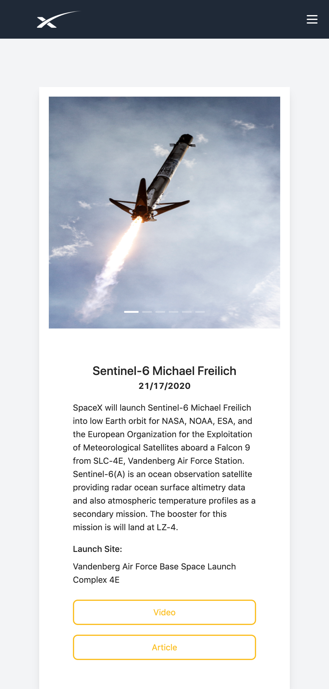
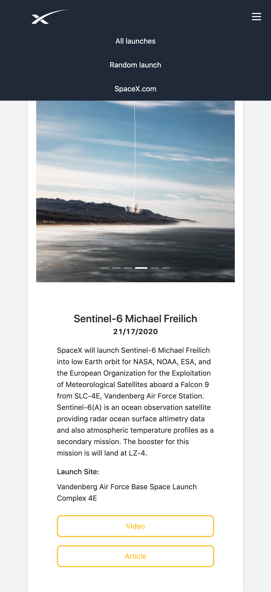

## Instructions

You can clone this repository and run with:

### `npm install`
### `npm start`

Runs the app in the development mode.\
Open [http://localhost:3000]to view it in the browser.

## Technologies 

The main technologies used in this project were:
- React JS- Components make it easy to write scalable, clean and reusable code.
- Tailwind CSS- Was instructed to work with Tailwind, however, I enjoyed using it so I will continue to do so!
- Ant Design - Only used to create a carousel of images in Mission.js 
- Apollo Client- Is compatible with React Js and Hooks, it requires almost no configuration and it´s easy to use.

## Improvements
Continue experimenting with Tailwind and create new customizations. 

## More time
- Create a search bar.
- use Tailwind @apply to reduce code 

## Prints

-Dashboard

-Mission

-open burger menu

