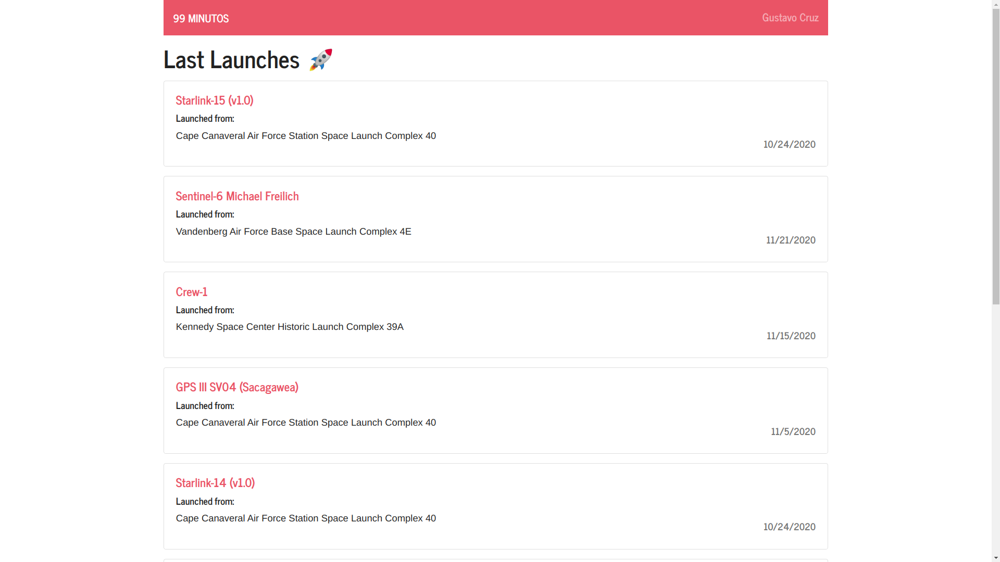
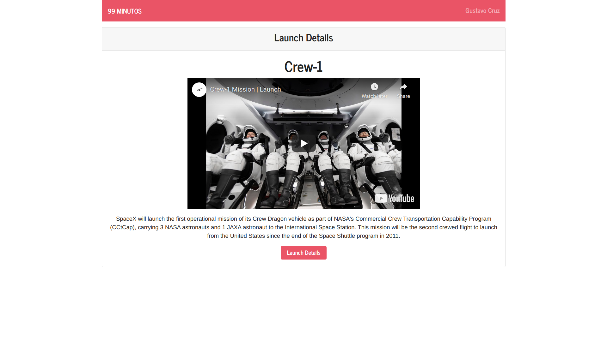

## Setup

Just clone the repo an run the following commands:

    npm install
    npm start

Now you can view it in the browser at **localhost:3000**.
I recommend Nodejs version 15.5.0 to run this project.

## Captures

View 1

View 2

## Tools

For this project I worked with different developing tool such as:

- React
- Apollo Client
- Bootstrap

I choosed to work with these tools for some particular reasons: React is the only frontend framework that I work with :sweat_smile:. Apollo, I think is the most straight forwarded way to aproach a Graphql API, and a CSS library as Bootstrap, helped me to save time giving my project some fine looks.

## Notes

I'm pretty satisfied with the result of this project, but, if I had more time to invest on it, maybe I would have styled the components with pure CSS and a library like _Styled Components_, instead of Bootstrap, because I like to have more control over what I'm developing.

**Thank you!!** :smiley:
