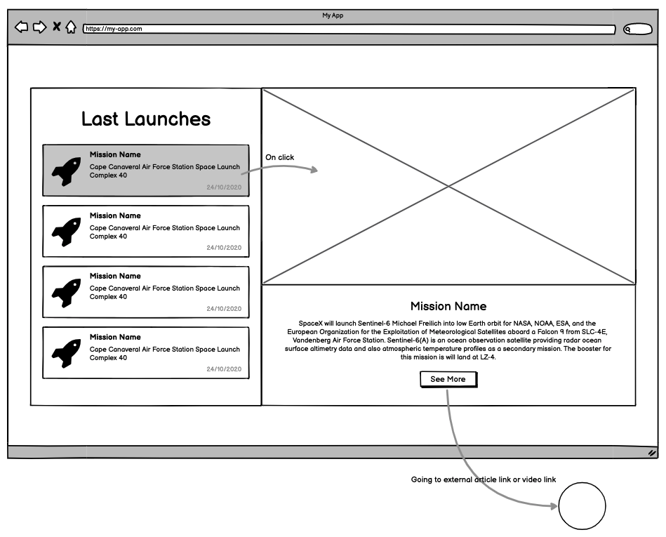

# 📦 99minutos Frontend Test

## Welcome!
If you’re reading this, it means we’re interested in working with you in 99minutos.com and solving amazing and difficult problems in shipping for online shopping tech in Latam.

This README provides the instructions to a small, self-contained test for a Frontend Software Engineer position.

## What we're looking for
We're looking for a talented and driven frontend developer, comfortable with building responsive front end experiences.

Experience building responsive, elegant and scalable web applications; understand cross-browser/platform compatibility issues.

# 🚀 Front-End Challenge
This is a quick coding challenge we designed to assess your qualifications as a potential front-end developer. It's important to note that this is by no means a test. We just want to get a sense of how you write code and solve problems.

## Getting started
To get started with this challenge: 
1) Fork this repository.
2) Create a branch with the name: ``yourlevel-yourname``, example: ``JR-joaosilva``
3) When you finish, make a pull request with name ``yourname``, example ``João Silva`` and add a tag with your level (JR/SR).

## The Challenge
We'll be looking for **simple, well-designed and tested(only SR)** code in the submission.

Please include a ``INSTRUCTIONS.md``:
- Add prints of your application in the repository and use them in the readme
- Setup instructions
- How did you decide which technologies to use as part of your solution
- Are there any improvements you could make to your submission
- What would you do differently if you were allocated more time

## Details
Use the [SpaceX Graphql API](https://api.spacex.land/graphql/) and create a project based on the following wireframe. Use your creativity to choose colors etc...

### The app
#### Last Launches Component
- List the last 10 missions
- Clicking on the card, shows the **Mission** on right component
- **Is very important** indicate what is the selected card

#### Mission Component
- Details of the mission (image, etc...)
- Button to external link

## Required
- React
- TDD (only SR)
- Responsive (Otional for JR / Required for SR)

## Desirable
- React using apollo client

## Deliverables
We expect this test to take around 5 hours, but not significantly more (your time is very valuable!). We're giving you 4 days from the date you receive it to complete it and send us your repo URL, using **the technology that you decide, of those mentioned in "required"**. Due to this, we ask that you also provide a `INSTRUCTIONS.md` with instructions for running your project, both api and frontend, along with setup instructions (or provide a Dockerfile and a `docker run` instruction).

### Bonus points
- Material UI
- Next.js
- Clean Code
- Your code has tests

If you come across any questions or anything we didn't cover on this README, feel free to reach out to us and we'll get you an answer as soon as possible.
If you have any question please contact eduardo.carrada@99minutos.com, isabel@99minutos.com, jonathan@99minutos.com or carlos.ramirez@99minutos.com
Happy coding!
