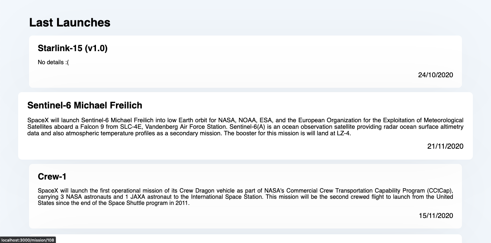
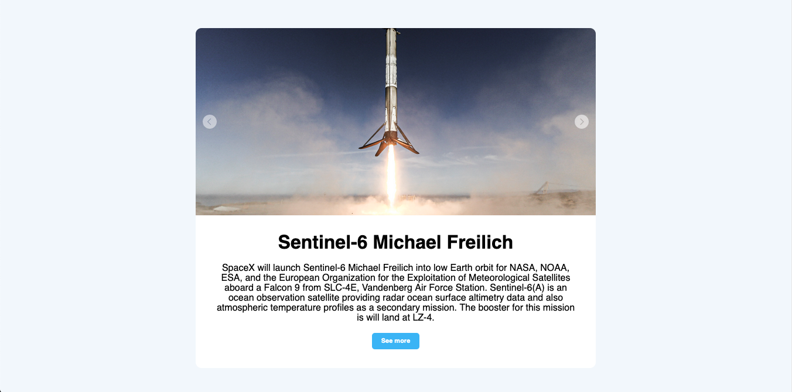

# 🚀 Front-End Challenge

This is the solution for the 99minutos Front-End challenge

## Table of contents

- [Previews](#previews)
- [Setup](#setup)
- [Technologies](#technologies)
- [If I had had more time](#if-i-had-more-time)

## Previews

First Screen


Second Screen


## Setup

To run this project, install it locally using npm:

```
$ npm install
$ npm start
```

## Technologies

- [React](https://reactjs.org/docs/getting-started.html)
- [Styled Components](https://styled-components.com/docs)
- [Apollo Client](https://www.apollographql.com/docs/react/)

I chose these technologies for the following:

- React: It is the framework that I like to use the most and that I master the most

- Apollo Client: I think that being GraphQL, Apollo Client is the best option to consume an API

- Styled Components: Honestly, I have always liked creating my own styles and what better way to do it than as components

## If I had more time

I really liked the result of the project, but, if I had had more time, I would have added some spinner for better UI / UX, I would have put in a SlideShow with animations

Developed with ⌨️ by David Victoria
