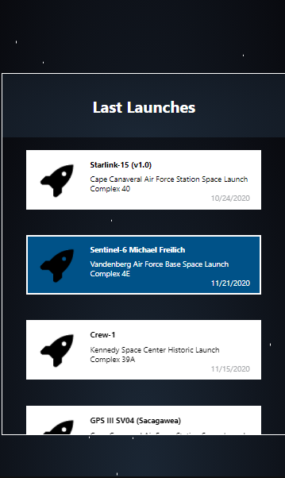

<p align="center">
  <h3 align="center">Frontend test</h3>
</p>

<details open="open">
  <summary><h2 style="display: inline-block">Table of Contents</h2></summary>
  <ol>
    <li><a href="#built-with">Built With</a></li>
    <li><a href="#installation">Installation</a></li>
    <li><a href="#technologies">Technologies</a></li>
    <li><a href="#improvements">Improvements</a></li>
    <li><a href="#different">Different</a></li>
    <li><a href="#screens">Screens</a></li>
    <li><a href="#contact">Contact</a></li>
  </ol>
</details>

### Built With

* [Apollo Client](https://www.apollographql.com/docs/react/)
* [ReactJs](https://es.reactjs.org/)
* [Redux](https://redux.js.org/)


### Installation

1. Clone the repo
   ```sh
   git clone https://github.com/ClawGibson/FrontEnd-Test
   ```
2. Install dependencies
   ```sh
   yarn
   ```
3. Run
   ```.env
   yarn start
   ```

### Technologies
<h3>How did you decide which technologies to use as part of your solution</h3>
<p>
  I decided to use React because his server side rendering and his compatibily with Redux to provide the fetched data.
</p>

### Improvements
<h3>Are there any improvements you could make to your submission</h3>
<p>
  I would love to add more animations to make the user interaction more comfortable, and fix the video player.
</p>

### Different
<h3>What would you do differently if you were allocated more time</h3>
<p>
  Thats probably would be the button. Also create some effects to selected card. 
</p>

### Screens


<br/ >

<br/ >

<br/ >

<br/ >

<br/ >

<br/ >

<!-- CONTACT -->
## Contact

Gamaliel Bernal - [Gamaliel Joaquín] - gamalielbj@gmail.com
