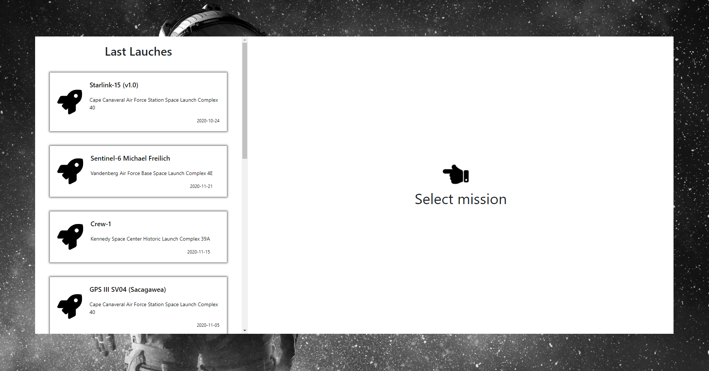
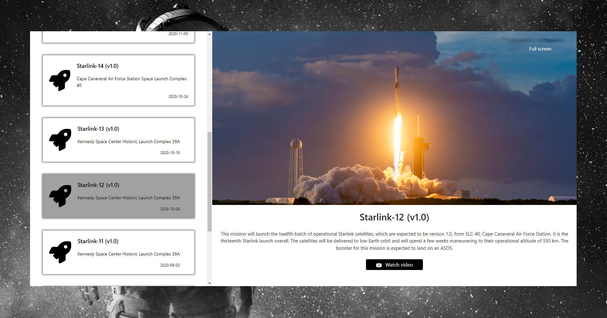
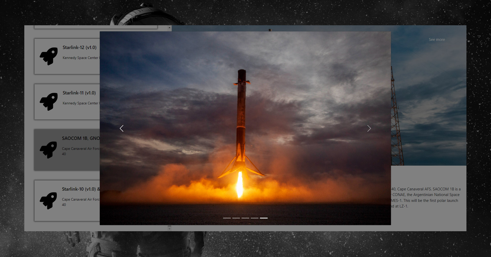
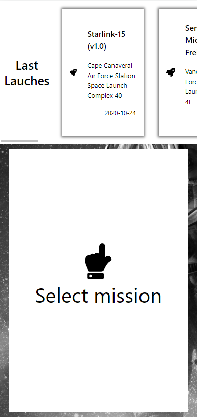
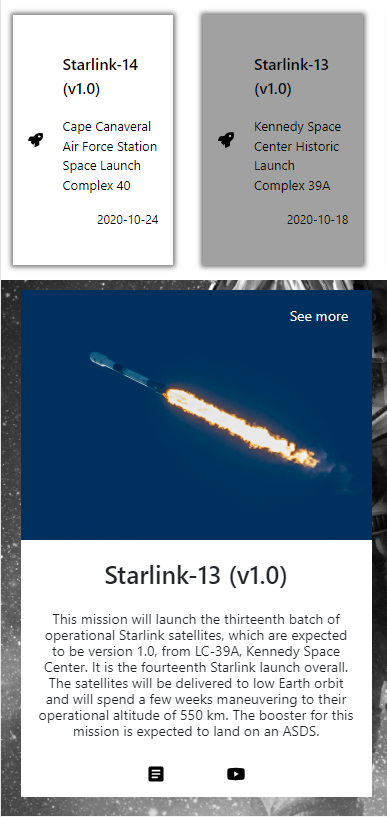
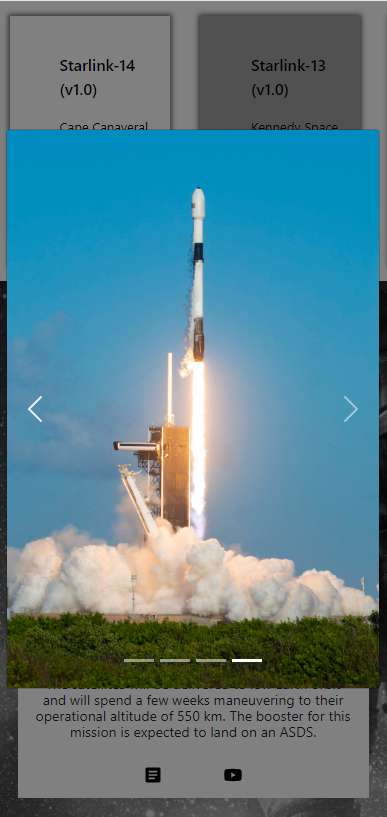

# Proyect SpaceX

## Tecnologias utilizas

Utilice las tecnologías requeridas por el reedme, dos de ellas no las conocía como Apollo Client y GraphQL, pude estudiarlas y ponerlas a funcionar en el proyecto.

La aplicación esta realizada con **ReactJS, Sass, react-bootstrap, react-icons.** Elegí usar estas tecnologías porque son las que más me gustan y utilizo con frecuencia, ya que la mayoría de mis proyectos están realizados con ellas.

## Mejoras

Me hubiese gustado poder aplicar testing y mejorar la parte responsive.

## Mas tiempo

Si tuviera más tiempo, aplicaría traer más misiones, donde haría un paginado para que no sea lenta la carga de datos. Jugaría un poco más con la info, como más detalles de las misiones.
Poder agregar a favoritos, un buscador, filtrados y más también ya que es bastante la información que tiene esta API.

## Instucciones

- Clonar repositorio
- cd spacex
- npm install
- npm start

### Ejecuta la aplicación en el modo de desarrollo [http://localhost:3000](http://localhost:3000)

# Capturas del proyecto

## Escritorio

- ### Seleccionar misión para poder ver los detalles
  
- ### Detalles de misión seleccionada
  
- ### Modal y Carousuel de Boostrap para poder ver más imágenes, mejor tamaño y calidad
  

## obile

  

### Muchas gracias por darme la oportunidad de poder aplicar mis conocimiento en el test, como tambien aprender nuevas tecnologias. Estoy contento por el resultado, espero que les guste.
